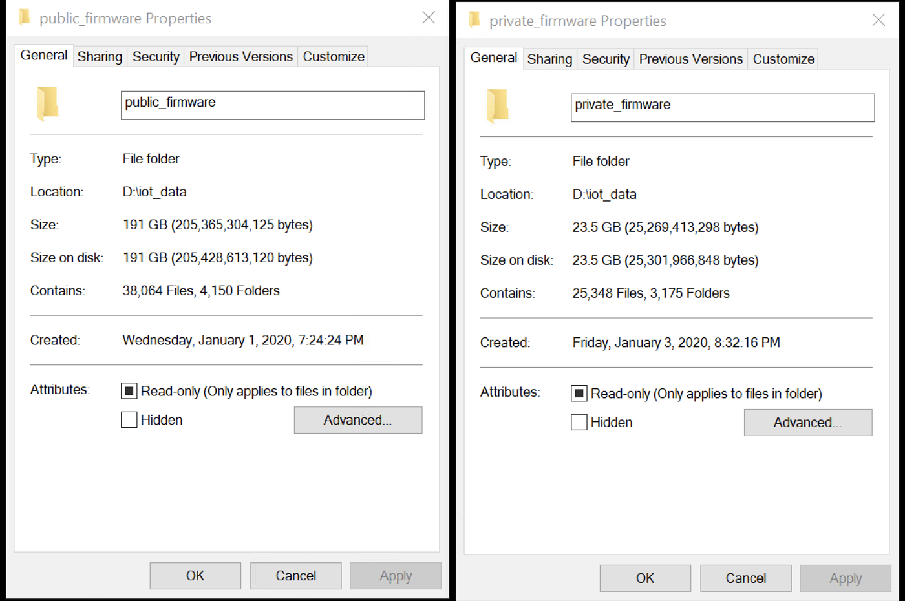

# FirmSec

## Dataset
Our dataset includes 11,086 publicly accessible firmware images and 23,050 private firmware images from TSmart.  Due to the potential ethical issues and the large size of the dataset, we provide the official download links of the public firmware images and open-source the private firmware images after desensitizing.

Please directly contact binbin.zhao@gatech.edu to get the dataset.



## Citation:
Please consider citing our paper, thanks!

```
@inproceedings{zhao2022firmsec,
author = {Zhao, Binbin and Ji, Shouling and Xu, Jiacheng and Tian, Yuan and Wei, Qiuyang and Wang, Qinying and Lyu, Chenyang and Zhang, Xuhong and Lin, Changting and Wu, Jingzheng and Beyah, Raheem},
title = {A Large-Scale Empirical Analysis of the Vulnerabilities Introduced by Third-Party Components in IoT Firmware},
year = {2022},
isbn = {9781450393799},
publisher = {Association for Computing Machinery},
address = {New York, NY, USA},
url = {https://doi.org/10.1145/3533767.3534366},
doi = {10.1145/3533767.3534366},
booktitle = {Proceedings of the 31st ACM SIGSOFT International Symposium on Software Testing and Analysis},
pages = {442–454},
numpages = {13},
keywords = {IoT firmware, Third-party component, Vulnerability},
location = {Virtual, South Korea},
series = {ISSTA 2022}
}
```